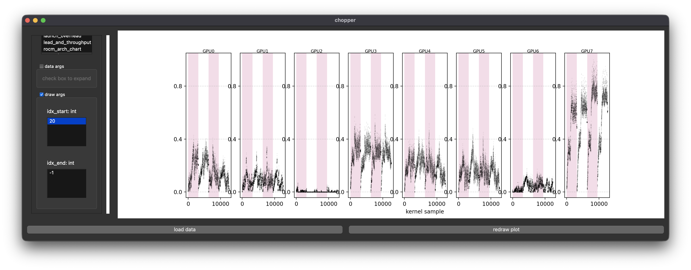

# Lit Silicon Benchmark & Evaluation (AMD)

> [!NOTE]
> Artifact in progress...

# Lit Silicon Benchmark & Evaluation (NVIDIA)

This repo provides an FSDP training benchmark that can be used to detect the "Lit Silicon" effect.
We are assuming the visualization will be done on a local computer while the benchmark will be ran on a remote node.
However, if a GUI is available on the remote node, all steps can be completed there.
Each step will be annotated with **(local)** or **(remote)** to designate where it should be performed.

## Setup

### Python virtual environment **(local & remote)**

Create a python virtual environment if you don't have one already.
This will be used for installing Chopper.

#### uv (recommended)

```
curl -LsSf https://astral.sh/uv/install.sh | sh
uv venv --python=3.12 --seed ls_venv
. ls_venv/bin/activate
```

#### python venv

```
python -m venv .ls_venv
. .ls_venv/bin/activate
```

1) Clone this benchmark and install Chopper **(local & remote)**

```
git clone --recursive https://github.com/UnaryLab/lit_silicon.git
cd lit_silicon/chopper
pip install .
cd ..
```

2) Build the container **(remote)**

> [!NOTE]
> While we use apptainer and slurm, docker can also be used since the [apptainer image](pytorch.def) only installs one additional python package. Adjust the scripts as needed.

```
./build.sh
```

## Running **(remote)**

1) Run the benchmark

This benchmark will run pytorch FSDPv2 training with batch size one sequence length 4k (b1s4), b2s4, and b1s8.
Raw traces will be inside a folder named the hostname, with the batch size and sequence length number as subfolders (e.g., if node `foobar` ran the benchmark, traces are in `foobar/b1s4`, `foobar/b2s4`, and `foobar/b1s8`).

```
./run_pytorch.sh
```

2) Merge traces using Chopper

This convenience script calls Chopper to aggregate all raw traces into a single pickle file.
Pass the directory you would like to merge as an argument (e.g., `hostname/b1s4` to merge batch size one sequence length 4k traces).

> [!WARNING]
> Do not pass **just** the hostname as the directory. If you did, results from `b1s4`, `b2s4`, and `b1s8` would all be merged together.

```
./chopper.sh hostname/bXsX
```

Now, the pickle file will be inside the directory passed and named `ts.pkl` (e.g., `hostname/bXsX/ts.pkl`).

## Visualization **(local)**

1) Copy the pickle to your local computer for visualization

Copy it any way you'd like, `rsync` is not required.

```
rsync -avzh <login_node>:/data/lit_silicon/hostname/bXsX/ts.pkl .
```

2) Open the Chopper GUI

```
python -m chopper.window
```

3) Select `straggler_per_gpu` under `available plots`

If `ts.pkl` isn't located inside the current directory, select the check box for `data args` and change the `dirs` entry to the directory `ts.pkl` is located.
You can also zoom in on a few iterations by changing `idx_start` and `idx_end` in the `draw args` (e.g., `idx_start`=5 and `idx_end`=10 to view samples 5-9).

4) Click `load data`, then click `redraw plot` once it becomes available.

If you change the `data args` you need to click `load data` and `redraw plot`. If you only changed `draw args` you only need to click `redraw plot` (i.e., you don't need to reload when changing only iterations to view).

In a system suffering from "Lit Silicon", you will observe one or more GPU consistently has a lower "lead" value than the others:



> In the above example, GPU2 is clearly the straggler, GPU6 is close, and other GPUs are leaders that all reach an equilibrium where the lead stops increasing due to increase communication overlap.
For more details check out [our paper on arxiv](https://arxiv.org/abs/2511.09861)!

## Cite our paper

```
@article{lit_silicon,
  title={{Lit Silicon: A Case Where Thermal Imbalance Couples Concurrent Execution in Multiple GPUs}},
  author={Kurzynski, Marco and Aga, Shaizeen and Wu, Di},
  journal={arXiv preprint arXiv:2511.09861},
  year={2025}
}
```


